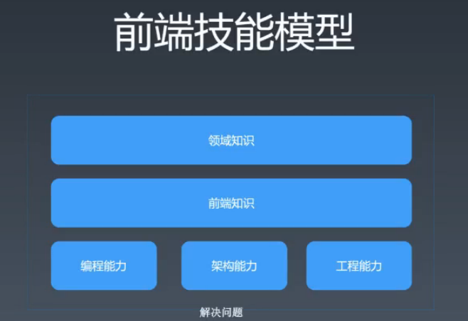

# day0

1. 思考问题
    1. 关于前端，你都会什么？
    2. 知识是否成体系的问题
    3. 知识堆叠的不完整
    4. 不知道自己会什么？
    5. 需要警醒，我们需要知识体系，不能在垃圾堆里里面学习东西，东西发霉了; 以为会了东西但是其实什么都不清楚。
2. 关于前端，你不会什么？
3. 有人会针线活的吗？会么还是不会呢？
    1. 因为我们知道什么是前端的，所以我们不会回答不会针线活。
    2. 所以我们真正需要前端需要什么？
    3. 什么是前端的范围内。
    4. 这个范围其实就是我们关于前端的体系的理解。

## 前端的边界，也就是前端到底有什么

1. 

### 编程能力

1. 编程能力： 所有的计算机岗位的基础，数据库算法，设计模式甚至使用 api 的能力。难的问题

### 架构能力

1. 大的问题，的处理能力。

### 工程能力

1. 人的问题。我们需要工程处理的能力。管理项目的能力。

### 领域知识

1. 关于技术之外，还需要了解项目之间的特别的东西。
2. 比如新零售，电商，视频直播等等相关的领域知识上。

### 前端知识

1. 关于前端知识，是本次课堂上面的了解主要内容。

### 学习能力的问题

1. 关于编程能力，架构能力，工程能力： 都是通过刻意练习练习的。
2. 关于前端知识： 建立知识体系（重学前端，前端训练营）
3. 而关于领域上面的知识： 我们通过实践中学习

### 关于架构能力的学习

1. 需要读源代码，需要通过参与开源软件来学习到。
2. 基本上是通过看别人的代码学习到的
3. 不是建议通读源代码，可以通过看一看别人的 issue 来读源代码，通过看别人的问题，来带着问题来看源代码。

### 本身课程

1. 提供了一个刻意练习的平台。

## 上课原则

1. 不追新不追热
2. 不教包装简历应付面试的技巧
3. 不教找捷径图省事的本领

## 前端的东西肯定是需要练习出来的，不是武林秘籍这么简单

## 学习方法-—— 整理法

1. 顺序关系，组合关系，维度关系，分类关系

### 顺序关系

1. 子节点是父节点的一个步骤，是一个顺序关系。子节点的每一个步骤完成了之后组成了父节点。

### 组合关系

### 维度关系

### 要注意完备性，因为东西漏了就容易规划错误

**summary**: 使用脑图，做出整理来

### whatwg.org, w3.org, 查找前端相关的内容

## 学习方法 --- 追溯法

1. 源头-> 标准和文档 -> 大师
2. 如何判断怎么对呢？
3. 就是使用第一步的方式

## 追溯法作业： 面向对象

1. 什么是好的面试题？
2. 区分度，深度，覆盖面

## 面试过程

1. 打断: 意味着不感兴趣，打断其实是一种提示
2. 争论: 争论与压力面试，争论的技巧
3. 难题: 展现分析过程，缩小规模

## 题目类型

1. 项目型，知识型，开放性，案例型，有趣的
